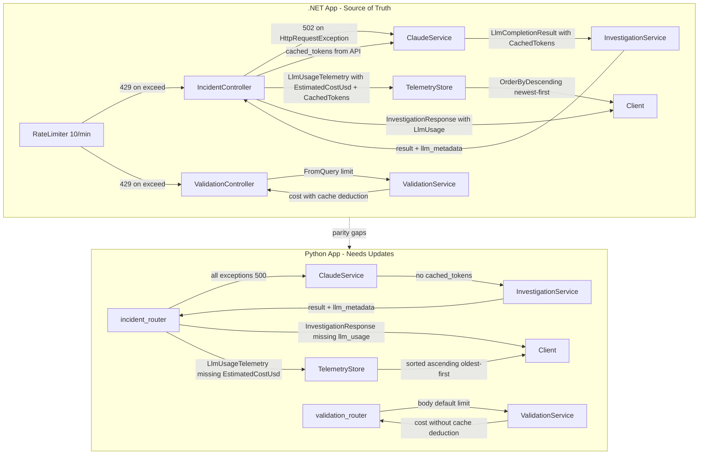
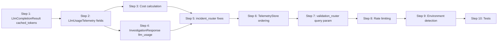

# Python ↔ .NET Parity Migration Plan

> **Source of truth**: `dotnet/` app  
> **Target**: `python/` app  
> **Date**: 2026-09-08

---

## Summary of Gaps

After a full side-by-side review of every controller, service, model, and helper in both runtimes, **13 gaps** were identified. They are grouped below by severity.

---

## Gap Analysis

### 🔴 Critical (API contract / data correctness)

| # | Gap | Dotnet (truth) | Python (current) |
|---|-----|----------------|------------------|
| GAP-1 | `cached_tokens` missing from `LlmUsageTelemetry` | [`LlmUsageTelemetry`](../../dotnet/src/Models/InvestigationTelemetryEvent.cs:58) has `CachedTokens: int` | [`LlmUsageTelemetry`](../../python/app/models/telemetry.py:15) has no `cached_tokens` field |
| GAP-2 | `cached_tokens` missing from `LlmCompletionResult` | [`LlmCompletionResult`](../../dotnet/src/Models/LlmCompletionResult.cs:32) has `CachedTokens = 0` default; [`ClaudeService`](../../dotnet/src/Services/ClaudeService.cs:57) reads `cache_read_input_tokens` from API | [`LlmCompletionResult`](../../python/app/services/llm_service.py:18) has no `cached_tokens`; [`ClaudeService`](../../python/app/services/llm_service.py:86) does not read `cache_read_input_tokens` |
| GAP-3 | Cost calculation ignores cache-read tokens | [`LlmCostHelper`](../../dotnet/src/Helper/LlmCostHelper.cs:20): `nonCachedInput = InputTokens - CachedTokens`; cache-read billed at $0.30/1M | [`_calculate_cost_usd()`](../../python/app/services/validation_service.py:28): `input_cost = input_tokens / 1M * 3.0` — no cache-read deduction |
| GAP-4 | `llm_usage` missing from `InvestigationResponse` | [`InvestigationResponse`](../../dotnet/src/Models/InvestigationResponse.cs:50) has `LlmUsage: LlmUsageTelemetry?` | [`InvestigationResponse`](../../python/app/models/investigation.py:28) has no `llm_usage` field; [`incident_router.py`](../../python/app/routers/incident_router.py:152) does not include it in the response |
| GAP-5 | `estimated_cost_usd` missing from `LlmUsageTelemetry` | [`LlmUsageTelemetry`](../../dotnet/src/Models/InvestigationTelemetryEvent.cs:80) has `EstimatedCostUsd: double?` | [`LlmUsageTelemetry`](../../python/app/models/telemetry.py:15) has no `estimated_cost_usd` |

### 🟠 High (behavioural / functional)

| # | Gap | Dotnet (truth) | Python (current) |
|---|-----|----------------|------------------|
| GAP-6 | `TelemetryStore.get_recent()` returns wrong order | [`TelemetryStore.GetRecent()`](../../dotnet/src/Services/TelemetryStore.cs:27): `OrderByDescending(e => e.Timestamp)` — **newest first** | [`TelemetryStore.get_recent()`](../../python/app/services/telemetry_store.py:37): `sorted(...key=lambda e: e.timestamp)` — **oldest first** |
| GAP-7 | Rate limiting absent on LLM endpoints | [`Program.cs`](../../dotnet/src/Program.cs:71): fixed-window 10 req/min per IP on `llm-investigation`; applied via `[EnableRateLimiting]` on [`POST /incidents/{id}/investigations`](../../dotnet/src/Controllers/IncidentController.cs:65) and [`POST /validation/run`](../../dotnet/src/Controllers/ValidationController.cs:42); returns 429 | No rate limiting in Python app |
| GAP-8 | `limit` in `validation_router.py` is not a query parameter | [`ValidationController`](../../dotnet/src/Controllers/ValidationController.cs:44): `[FromQuery] int limit = MaxLimit` | [`validation_router.py`](../../python/app/routers/validation_router.py:55): `limit: int = _MAX_LIMIT` — treated as a request body default, not a query param |
| GAP-9 | Error handling in `incident_router.py` is too broad | [`IncidentController.Investigate()`](../../dotnet/src/Controllers/IncidentController.cs:129): `HttpRequestException` → 502 Bad Gateway; `InvalidOperationException` → 500 | [`incident_router.py`](../../python/app/routers/incident_router.py:157): all exceptions → 500 |

### 🟡 Medium (field ordering / environment)

| # | Gap | Dotnet (truth) | Python (current) |
|---|-----|----------------|------------------|
| GAP-10 | `InvestigationResponse` field order differs | [`InvestigationResponse`](../../dotnet/src/Models/InvestigationResponse.cs:15): `investigation` → `publishLatencySeconds` → `recommendedAction` → `llmUsage` | [`InvestigationResponse`](../../python/app/models/investigation.py:28): `investigation` → `recommended_action` → `publish_latency_seconds` (missing `llm_usage`) |
| GAP-11 | `config_router.py` hardcodes environment | [`AdminController.GetConfig()`](../../dotnet/src/Controllers/AdminController.cs:48): `Environment: _env.EnvironmentName` (reads from `IWebHostEnvironment`) | [`config_router.py`](../../python/app/routers/config_router.py:75): `environment="Production"` hardcoded |

### 🟢 Low (async vs sync, cosmetic)

| # | Gap | Dotnet (truth) | Python (current) |
|---|-----|----------------|------------------|
| GAP-12 | `TelemetryStore.Add()` is synchronous in dotnet | [`ITelemetryStore.Add()`](../../dotnet/src/Interfaces/ITelemetryStore.cs:9): `void Add(...)` — synchronous | [`TelemetryStore.add()`](../../python/app/services/telemetry_store.py:25): `async def add(...)` with `asyncio.Lock` — functionally equivalent but different signature |
| GAP-13 | Tests don't cover new fields | Python tests don't assert `cached_tokens`, `estimated_cost_usd`, or `llm_usage` in responses | — |

---

## Architecture Diagram



---

## Migration Steps (Ordered by Dependency)

### Step 1 — `LlmCompletionResult`: Add `cached_tokens`
**File**: [`python/app/services/llm_service.py`](../../python/app/services/llm_service.py)

- Add `cached_tokens: int = 0` field to the `LlmCompletionResult` dataclass.
- In `ClaudeService.complete_async()`, read `usage.get("cache_read_input_tokens", 0)` from the Claude API response and populate `cached_tokens`.

---

### Step 2 — `LlmUsageTelemetry`: Add `cached_tokens` + `estimated_cost_usd`
**File**: [`python/app/models/telemetry.py`](../../python/app/models/telemetry.py)

- Add `cached_tokens: int = 0` to `LlmUsageTelemetry`.
- Add `estimated_cost_usd: Optional[float] = None` to `LlmUsageTelemetry`.

---

### Step 3 — Cost calculation: Account for cache-read tokens
**File**: [`python/app/services/validation_service.py`](../../python/app/services/validation_service.py)

- Add `_CACHE_READ_COST_PER_M = 0.30` constant.
- Update `_calculate_cost_usd()`:
  ```python
  non_cached_input = max(0, llm_metadata.input_tokens - llm_metadata.cached_tokens)
  input_cost  = non_cached_input / 1_000_000 * _INPUT_COST_PER_M
  cache_cost  = llm_metadata.cached_tokens / 1_000_000 * _CACHE_READ_COST_PER_M
  output_cost = llm_metadata.output_tokens / 1_000_000 * _OUTPUT_COST_PER_M
  return input_cost + cache_cost + output_cost
  ```

---

### Step 4 — `InvestigationResponse`: Add `llm_usage` + fix field order
**File**: [`python/app/models/investigation.py`](../../python/app/models/investigation.py)

- Add `llm_usage: Optional[LlmUsageTelemetry] = None` field.
- Reorder fields to match dotnet: `investigation` → `publish_latency_seconds` → `recommended_action` → `llm_usage`.
- Import `LlmUsageTelemetry` from `app.models.telemetry`.

---

### Step 5 — `incident_router.py`: Populate `llm_usage` + fix error handling + populate `estimated_cost_usd`
**File**: [`python/app/routers/incident_router.py`](../../python/app/routers/incident_router.py)

- Add a `_compute_estimated_cost_usd()` helper (mirrors [`LlmCostHelper`](../../dotnet/src/Helper/LlmCostHelper.cs)).
- Populate `LlmUsageTelemetry` with `cached_tokens` and `estimated_cost_usd`.
- Pass `llm_usage` to `InvestigationResponse`.
- Split exception handling:
  - `httpx.HTTPStatusError` / `httpx.RequestError` → 502 Bad Gateway
  - `ValueError` / `InvalidOperationException`-equivalent → 500 Internal Server Error

---

### Step 6 — `TelemetryStore.get_recent()`: Fix ordering to newest-first
**File**: [`python/app/services/telemetry_store.py`](../../python/app/services/telemetry_store.py)

- Change `sorted(recent, key=lambda e: e.timestamp)` to `sorted(recent, key=lambda e: e.timestamp, reverse=True)` to match dotnet's `OrderByDescending`.

---

### Step 7 — `validation_router.py`: Fix `limit` as query parameter
**File**: [`python/app/routers/validation_router.py`](../../python/app/routers/validation_router.py)

- Change `limit: int = _MAX_LIMIT` to `limit: int = Query(default=_MAX_LIMIT, ge=1, le=_MAX_LIMIT)`.
- Import `Query` from `fastapi`.

---

### Step 8 — Rate limiting on LLM endpoints
**File**: [`python/app/main.py`](../../python/app/main.py) + [`python/app/routers/incident_router.py`](../../python/app/routers/incident_router.py) + [`python/app/routers/validation_router.py`](../../python/app/routers/validation_router.py)

- Add `slowapi` (or `fastapi-limiter`) as a dependency in [`python/pyproject.toml`](../../python/pyproject.toml).
- Configure a fixed-window rate limiter: 10 requests/minute per client IP.
- Apply to `POST /incidents/{id}/investigations` and `POST /validation/run`.
- Return 429 when limit is exceeded.

---

### Step 9 — `config_router.py`: Dynamic environment detection
**File**: [`python/app/routers/config_router.py`](../../python/app/routers/config_router.py)

- Read environment from an env var (e.g. `APP_ENVIRONMENT` or `ASPNETCORE_ENVIRONMENT`) with a fallback of `"Production"`.
- Add `app_environment: str = "Production"` to `Settings` or read directly from `os.environ`.

---

### Step 10 — Update tests
**Files**: [`python/tests/test_investigation.py`](../../python/tests/test_investigation.py), [`python/tests/test_validation.py`](../../python/tests/test_validation.py)

- Add assertions for `llm_usage` in `InvestigationResponse`.
- Add assertions for `cached_tokens` and `estimated_cost_usd` in `LlmUsageTelemetry`.
- Add a test verifying `GET /telemetry` returns events in descending order.
- Add a test verifying `POST /validation/run?limit=5` accepts `limit` as a query parameter.

---

## Dependency Order



---

## Files to Modify

| File | Steps |
|------|-------|
| [`python/app/services/llm_service.py`](../../python/app/services/llm_service.py) | 1 |
| [`python/app/models/telemetry.py`](../../python/app/models/telemetry.py) | 2 |
| [`python/app/services/validation_service.py`](../../python/app/services/validation_service.py) | 3 |
| [`python/app/models/investigation.py`](../../python/app/models/investigation.py) | 4 |
| [`python/app/routers/incident_router.py`](../../python/app/routers/incident_router.py) | 5 |
| [`python/app/services/telemetry_store.py`](../../python/app/services/telemetry_store.py) | 6 |
| [`python/app/routers/validation_router.py`](../../python/app/routers/validation_router.py) | 7 |
| [`python/pyproject.toml`](../../python/pyproject.toml) | 8 |
| [`python/app/main.py`](../../python/app/main.py) | 8 |
| [`python/app/routers/config_router.py`](../../python/app/routers/config_router.py) | 9 |
| [`python/tests/test_investigation.py`](../../python/tests/test_investigation.py) | 10 |
| [`python/tests/test_validation.py`](../../python/tests/test_validation.py) | 10 |
